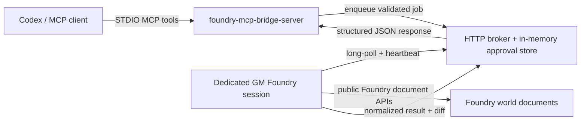

# Foundry MCP Bridge

This repository contains two deployable codebases for a safety-first Foundry VTT bridge:

- `foundry-mcp-bridge-server`: a local MCP server that exposes a narrow tool surface to Codex and other agents.
- `foundryvtt-mcp-bridge-module`: a Foundry VTT v13 module that performs allowlisted document operations through Foundry's public APIs.

The bridge is intentionally small in v1:

- No arbitrary code execution
- No macro execution
- No filesystem write tools
- No delete operations
- No permission rewrites
- No module management

## Repository Layout

- `/Users/nicholasmcdowell/Developer/foundry-mcp/package.json`
- `/Users/nicholasmcdowell/Developer/foundry-mcp/packages/shared`
- `/Users/nicholasmcdowell/Developer/foundry-mcp/packages/foundry-mcp-bridge-server`
- `/Users/nicholasmcdowell/Developer/foundry-mcp/packages/foundryvtt-mcp-bridge-module`
- `/Users/nicholasmcdowell/Developer/foundry-mcp/docs/tool-reference.md`
- `/Users/nicholasmcdowell/Developer/foundry-mcp/docs/test-plan.md`
- `/Users/nicholasmcdowell/Developer/foundry-mcp/scripts/install-foundry-module.mjs`

## Architecture



## Local Development Setup

1. Open a terminal in `/Users/nicholasmcdowell/Developer/foundry-mcp`.
2. Run `npm install`.
   - This downloads the TypeScript, MCP, Fastify, and test dependencies used by the workspace.
   - Risk: it installs packages from npm, so it needs network access.
3. Copy `.env.example` to `.env` if you want a local shell file for the server settings.
4. Run `npm run build`.
   - This compiles the server and module and exports JSON Schema files from the shared package.
5. Run `npm run test`.
   - This runs the unit and integration-scaffolding tests.
6. Link the Foundry module with `npm run install:module`.
   - This creates a symlink (a filesystem shortcut) from your Foundry data folder to `/Users/nicholasmcdowell/Developer/foundry-mcp/packages/foundryvtt-mcp-bridge-module`.
   - Risk: it replaces any existing module folder at the same target path.
7. In Foundry VTT v13, enable the module and configure its settings as a GM.
   - Use **Game Settings -> Configure Settings** and scroll to the `Foundry VTT MCP Bridge` settings.
8. Keep one dedicated GM session open so the bridge can poll for work.
9. Start the MCP bridge server with `node /Users/nicholasmcdowell/Developer/foundry-mcp/packages/foundry-mcp-bridge-server/dist/index.js`.

## Sample Codex MCP Config

Add a block like this to `~/.codex/config.toml`:

```toml
[mcp_servers.foundry_bridge]
command = "node"
args = ["/Users/nicholasmcdowell/Developer/foundry-mcp/packages/foundry-mcp-bridge-server/dist/index.js"]

[mcp_servers.foundry_bridge.env]
BRIDGE_BIND_HOST = "127.0.0.1"
BRIDGE_BIND_PORT = "3310"
BRIDGE_SHARED_TOKEN = "replace-with-a-long-random-token"
BRIDGE_APPROVAL_TTL_SECONDS = "300"
BRIDGE_REQUEST_TIMEOUT_MS = "15000"
BRIDGE_LOG_LEVEL = "info"
BRIDGE_DEV_MODE = "true"
```

## Threat Model

### Main threats addressed in v1

- Untrusted agent input attempting arbitrary document patching
- Replay of previously approved writes
- Hidden data mutation without audit context
- Broad flag or `system` writes that bypass GM intent
- Bridge access from a non-owner Foundry session

### Main controls

- Strict JSON schemas with unknown fields rejected
- Allowlisted tool names, document types, and writable fields
- Dry-run support on every write tool
- Short-lived, single-use approval tokens
- Dedicated GM bridge ownership
- Bearer-token authentication between the module and bridge server
- Structured JSON-line audit logging

## Socketlib In v1

Socketlib is **not required** in the main v1 flow. The Foundry module runs in a dedicated GM session and performs document work locally through public document APIs.

Socketlib would only become useful later if you decide to relay already-approved work from other connected clients to the bridge-owner GM session. Even in that future case, it should remain strictly allowlisted and must never become a generic remote execution channel.

## More Reference Docs

- Tool examples for every v1 MCP tool: `/Users/nicholasmcdowell/Developer/foundry-mcp/docs/tool-reference.md`
- Automated and manual validation steps: `/Users/nicholasmcdowell/Developer/foundry-mcp/docs/test-plan.md`
- Foundry module GitHub/manifest install workflow: `/Users/nicholasmcdowell/Developer/foundry-mcp/docs/foundry_remote_install.md`

## GitHub Workflow

Earlier Foundry projects in this workspace use the same GitHub pattern:

- initialize the local folder as a git repository if needed
- add a GitHub `origin` remote
- prepare the Foundry module manifest with public `url`, `manifest`, and `download` fields
- build a release zip
- publish the release zip with GitHub CLI (`gh`)

This repo now includes the same helper scripts for the module package:

- `/Users/nicholasmcdowell/Developer/foundry-mcp/scripts/release/prepare-foundry-module.mjs`
- `/Users/nicholasmcdowell/Developer/foundry-mcp/scripts/release/publish-github-release.mjs`

If this folder is not yet a git repo, start with:

```bash
cd "/Users/nicholasmcdowell/Developer/foundry-mcp"
git init
git add .
git commit -m "Initial commit"
git remote add origin https://github.com/<you>/<repo>.git
git push -u origin main
```

Command explanation:

- `git init` creates a new local git repository in this folder.
- `git add .` stages the current files for the first commit.
- `git commit -m ...` records that snapshot in git history.
- `git remote add origin ...` stores the GitHub repository URL under the name `origin`.
- `git push -u origin main` publishes the `main` branch and remembers it as the default upstream.

Risk:

- `git add .` stages every unignored file in the repo, so review with `git status` before committing if needed.
- `git remote add origin ...` fails if `origin` already exists.

## v2 TODO

- Replace bearer tokens with signed request envelopes
- Add persistent audit sink integration
- Add optional socketlib relay for multi-client worlds
- Add richer scene summaries and read-only token summaries
- Add safer ownership presets after an explicit design pass
